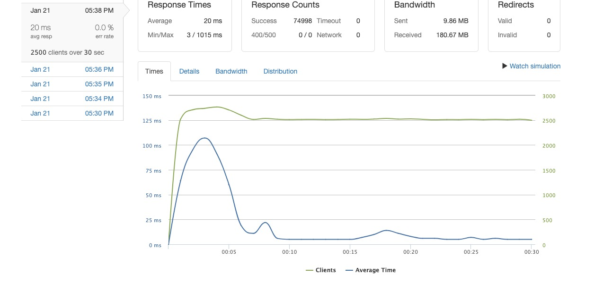
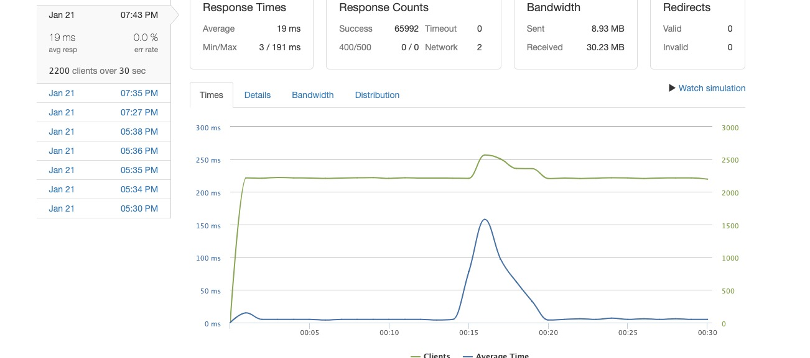

<h1 align="center">Echo System Design<h1>

## Description
***Echo System Design*** is a back end system designed, built, tested, and optimized to increase performance of a ratings and reviews micro service, belonging to a mock e-commerce website. Originally, the back end of this website was a monolithic design and needed performance improvements to handle increased web traffic. The PostgreSQL database was loaded with 31M records and queries were built using PostgreSQL functions and subqueries to decrease read/write response times. The server and API enpoints were developed using ExpressJS. The system's final design consisted of one NGINX load balancer, three EC2 micro servers, and one database server (see diagram below). Testing was performed locally using k6 and then deployed to AWS. The deployed version was tested using Loader_IO (see performance metrics in section below).

<!-- insert backend design here -->

---
## Performance
**NOTE:** Perormance concerns revolved primarily around read operations. Write operations were also addressed but not the main focus of the project.
- GET request for Reviews:
    - The max performance of the system was able to handle about **2500 RPS** with average response time of **20 ms** with **0% error rate** when testing with [loader_io](https://loader.io/).

- GET request for Meta data:
    - The max performance of the system was able to handle about **2200 RPS** with average response time of **19 ms** with **0% error rate** when testing with [loader_io](https://loader.io/).

---
## Installation
**Make sure your system meets the requirements below before following installation**
1. Clone this repo to your local machine:
    - `git clone https://github.com/Mitch311G/Echo-System-Design.git`
2. Navigate the repo's root directory:
    - `cd Echo-System-Design`
3. Install project dependencies:
    - `npm install`
4. For local development, set up a local [PostgreSQL](https://www.postgresql.org/docs/) database.
    - After your local database is available, create a `.env` file in the root directory containing your local database info. See `.env.example` for reference.
    - **NOTE:** You should use the tables in the schema file to create your database, however, data files used to load the database are proprietary. Thus, you will need to create your own test data and avoid running sections that say `load * table`.
5. Run `npm run start-dev` to start development server at `localhost:3000`.
6. Start developing!

### Requirements
- Install the following to your system (if not done already):
    - [Node.js and npm](https://nodejs.org/en/download/)
    - [PostgreSQL](https://www.postgresql.org/download/)
---

## Provided scripts
- `npm run start-dev`
    - Starts the development server (default is localhost:3000), then **watches for changes and restarts the serve with updated content on file change**.
- `npm run start`
    - Starts the app's server, but **does not watch for file changes**.
---

## Author and acknowledgment
***Echo System Design*** was written by Mitchell Gardner as a micro service. The other micro services (not in this repo) were created by my teammates [Prith Jaganathan](https://github.com/prith98) and [Benjamin Cunningham](https://github.com/my-name-is-ben) to collectively and effectively tackle the entire project's requirements. To view the rest of the project, [see here](https://github.com/team-silvally).

---

## Future enhancements
At the moment, best back end practices are not implemented with separating controllers and models. In the future, the file strucutre of the system will implement these best practices and allow for better separation of concerns. You will currently find both request handlers and database queries in `PostgresDB/index.js`.
